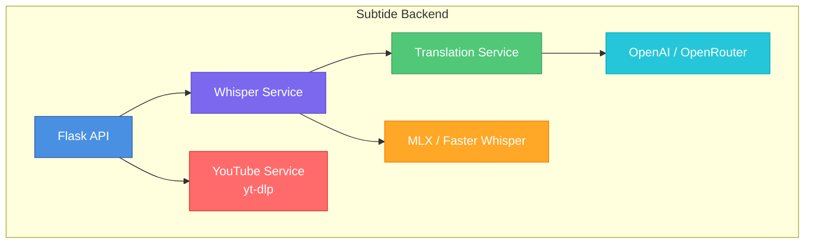

# Backend Overview

Understanding the Subtide backend server.

---

## Architecture

The Subtide backend is a Flask-based REST API that handles:

1. **Video Processing** - Downloading and extracting audio
2. **Transcription** - Converting speech to text using Whisper
3. **Translation** - Translating text using LLM APIs
4. **Streaming** - Real-time translation for Tier 4



---

## Deployment Options

| Option | Best For | Setup Difficulty |
|--------|----------|------------------|
| **Binary** | Personal use, quick start | Easy |
| **Python Source** | Development, customization | Medium |
| **Docker** | Production, teams | Medium |
| **RunPod** | GPU acceleration, cloud | Medium |

---

## Quick Start

### Binary (Fastest)

```bash
# Download from releases
chmod +x subtide-backend-macos
./subtide-backend-macos
```

### Docker (Production)

```bash
cd backend
docker-compose up subtide-tier2
```

### Source (Development)

```bash
cd backend
python -m venv venv
source venv/bin/activate
pip install -r requirements.txt
./run.sh
```

---

## Whisper Backends

Subtide supports multiple Whisper implementations:

### MLX (Apple Silicon)

Optimized for M1/M2/M3/M4 Macs:

```bash
WHISPER_BACKEND=mlx ./subtide-backend
```

- Uses unified memory efficiently
- No separate GPU memory needed
- Best for macOS users

### Faster-Whisper (NVIDIA)

CUDA-accelerated for NVIDIA GPUs:

```bash
WHISPER_BACKEND=faster ./subtide-backend
```

- Requires CUDA toolkit
- Significant speedup on supported GPUs
- Best for Linux/Windows with NVIDIA

### OpenAI Whisper (Cloud)

Original Whisper implementation:

```bash
WHISPER_BACKEND=openai ./subtide-backend
```

- CPU-based (slower)
- Works everywhere
- Fallback option

---

## Model Selection

| Model | Size | Speed | Quality |
|-------|------|-------|---------|
| `tiny` | ~39 MB | Fastest | Basic |
| `base` | ~74 MB | Fast | Good |
| `small` | ~244 MB | Medium | Better |
| `medium` | ~769 MB | Slow | Great |
| `large-v3` | ~1.5 GB | Slowest | Best |
| `large-v3-turbo` | ~800 MB | Fast | Excellent |

**Recommended**: `large-v3-turbo` for best speed/quality ratio.

---

## Hardware Requirements

### Apple Silicon

| Mac | Memory | Recommended Model |
|-----|--------|-------------------|
| 8 GB | Limited | `tiny`, `base` |
| 16 GB | Good | `small`, `base` |
| 32 GB | Excellent | `large-v3` |
| 64 GB+ | Optimal | Any model |

### NVIDIA GPUs

| GPU | VRAM | Recommended Model |
|-----|------|-------------------|
| RTX 3060 | 12 GB | `medium` |
| RTX 3090/4080 | 16-24 GB | `large-v3` |
| RTX 4090 | 24 GB | Any model |

---

## Environment Variables

Core configuration:

| Variable | Description | Default |
|----------|-------------|---------|
| `PORT` | Server port | `5001` |
| `WHISPER_MODEL` | Model size | `base` |
| `WHISPER_BACKEND` | Backend type | Auto |
| `CORS_ORIGINS` | Allowed origins | `*` |

See [Configuration](../getting-started/configuration.md) for full list.

---

## Health Check

Verify the backend is running:

```bash
curl http://localhost:5001/health
```

Expected response:

```json
{"status": "healthy"}
```

---

## Next Steps

- [Docker Deployment](docker.md) - Container deployment
- [RunPod Deployment](runpod.md) - Cloud GPU deployment
- [Local LLM Setup](local-llm.md) - Use local models
- [API Reference](../api/endpoints.md) - API documentation
