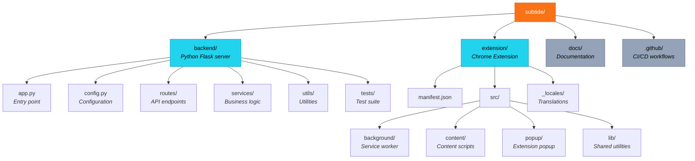

# Contributing

Guide for contributing to Subtide development.

---

## Getting Started

### Prerequisites

- Node.js 18+
- Python 3.9+
- FFmpeg
- Git

### Clone Repository

```bash
git clone https://github.com/rennerdo30/subtide.git
cd subtide
```

---

## Development Setup

### Backend

```bash
cd backend

# Create virtual environment
python -m venv venv
source venv/bin/activate  # Windows: venv\Scripts\activate

# Install dependencies
pip install -r requirements.txt
pip install -r requirements-dev.txt

# Run development server
./run.sh
```

### Extension

```bash
# No build step required - extension uses vanilla JS

# Load in Chrome:
# 1. Go to chrome://extensions
# 2. Enable Developer mode
# 3. Load unpacked → select 'extension' folder
```

---

## Project Structure



---

## Running Tests

### Backend Tests

```bash
cd backend

# Run all tests
pytest

# With coverage
pytest --cov=. --cov-report=term-missing

# Specific test file
pytest tests/test_translation.py

# Verbose output
pytest -v
```

### Test Coverage Goal

We aim for close to 100% test coverage. All new features and bug fixes should include tests.

---

## Code Style

### Python (Backend)

- Follow PEP 8
- Use type hints where practical
- Maximum line length: 100 characters

### JavaScript (Extension)

- Use ES6+ features
- No external dependencies (vanilla JS)
- Use JSDoc comments for complex functions

---

## Making Changes

### 1. Create a Branch

```bash
git checkout -b feature/your-feature-name
```

### 2. Make Your Changes

- Write code
- Add tests
- Update documentation if needed

### 3. Run Tests

```bash
cd backend
pytest
```

### 4. Commit

```bash
git add .
git commit -m "Add feature: description"
```

### 5. Push and Create PR

```bash
git push origin feature/your-feature-name
```

Then create a Pull Request on GitHub.

---

## Pull Request Guidelines

### Before Submitting

- [ ] All tests pass
- [ ] Code follows style guidelines
- [ ] Documentation updated (if applicable)
- [ ] Commit messages are clear

### PR Description

Include:
- What the PR does
- Why the change is needed
- How to test it
- Screenshots (for UI changes)

---

## Reporting Issues

### Bug Reports

Include:
- Browser and version
- Operating system
- Steps to reproduce
- Expected vs actual behavior
- Error messages
- Screenshots if applicable

### Feature Requests

Include:
- Clear description of the feature
- Use case / why it's needed
- Any implementation ideas

---

## Architecture Decisions

### Extension

- **Manifest V3**: Required for modern Chrome extensions
- **Vanilla JS**: No build step, easier debugging
- **Content Scripts**: Separate scripts per platform (YouTube, Twitch, generic)

### Backend

- **Flask**: Simple, well-documented
- **Gunicorn**: Production-ready server
- **Multiple Whisper backends**: Support different hardware

---

## Areas for Contribution

### Good First Issues

- Documentation improvements
- Bug fixes
- Test coverage
- Localization (new languages)

### Larger Projects

- Safari extension support
- Additional video platforms
- Performance optimizations
- UI/UX improvements

---

## Community

- [GitHub Issues](https://github.com/rennerdo30/subtide/issues) - Bug reports, feature requests
- [GitHub Discussions](https://github.com/rennerdo30/subtide/discussions) - Questions, ideas

---

## License

By contributing, you agree that your contributions will be licensed under the MIT License.
